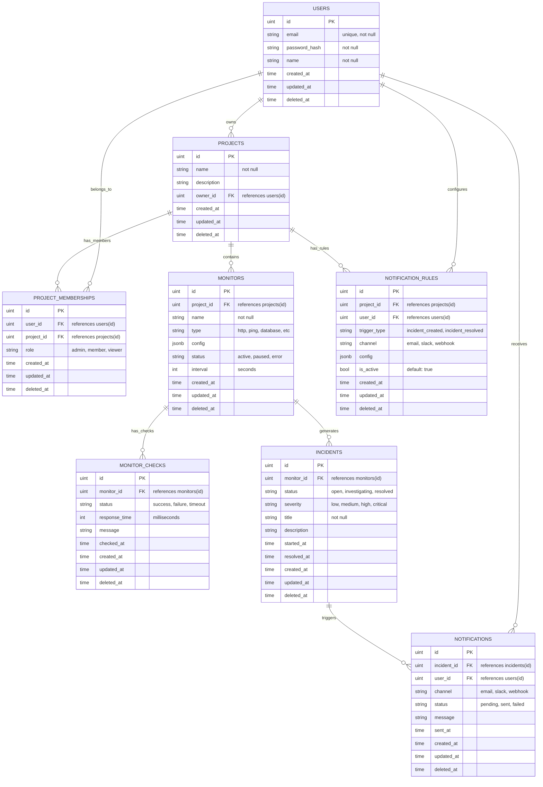

# Database Schema

This document describes the database schema for Monocle, designed for use with GORM and PostgreSQL.

## Entity Relationship Diagram

## Model Descriptions

### Users

Stores user authentication and profile information. Each user can own multiple projects and be a member of others through project memberships.

### Projects

Top-level containers for monitoring resources. Each project has an owner and can have multiple team members. Projects group related monitors and define access boundaries.

### Project Memberships

Many-to-many relationship between users and projects. Defines user roles within a project (admin, member, viewer). Roles implicitly define permissions - admins can manage everything, members can create/edit monitors, viewers can only read.

### Monitors

Individual monitoring endpoints or resources (websites, APIs, databases, etc.). The `config` field stores monitor-specific settings like URLs, timeouts, expected responses. The `type` field determines what kind of monitoring is performed.

### Monitor Checks

Historical record of all monitor executions. Stores the result of each check including response time, status, and error messages. Essential for analytics, dashboards, and debugging monitor issues.

### Incidents

Groups related monitor failures into manageable incidents. Supports escalation workflows with severity levels and status tracking. Incidents can be manually created or auto-generated from monitor failures.

### Notifications

Log of all notifications sent to users about incidents. Tracks delivery status across different channels (email, Slack, webhooks) and provides an audit trail.

### Notification Rules

User-configurable rules for when and how to receive notifications. Allows users to customize their alerting preferences per project, including trigger types and delivery channels.

## Implementation Notes

- All tables use `gorm.Model` for ID, timestamps, and soft deletes.
- Foreign keys and relationships are defined for GORM auto-migration.
- Use `datatypes.JSON` for `jsonb` fields.
- Add `gorm` struct tags for constraints and validation.
- Indexes for foreign keys and frequently queried fields are recommended.
